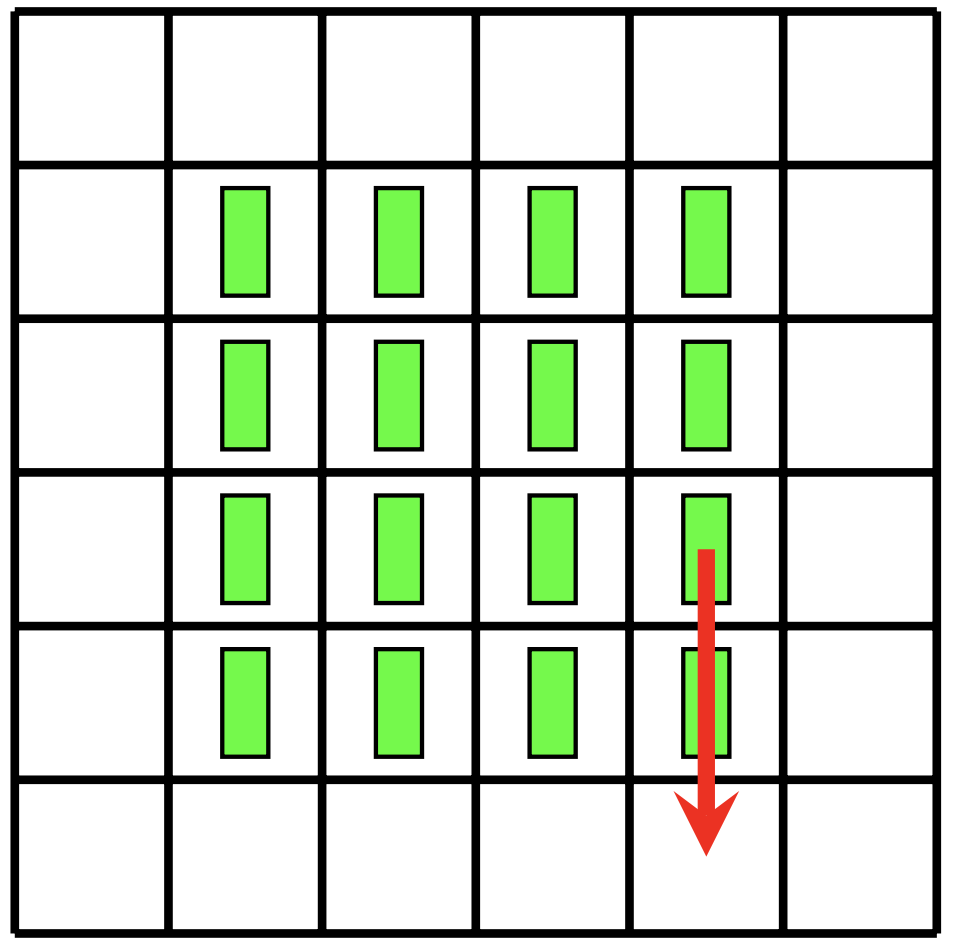
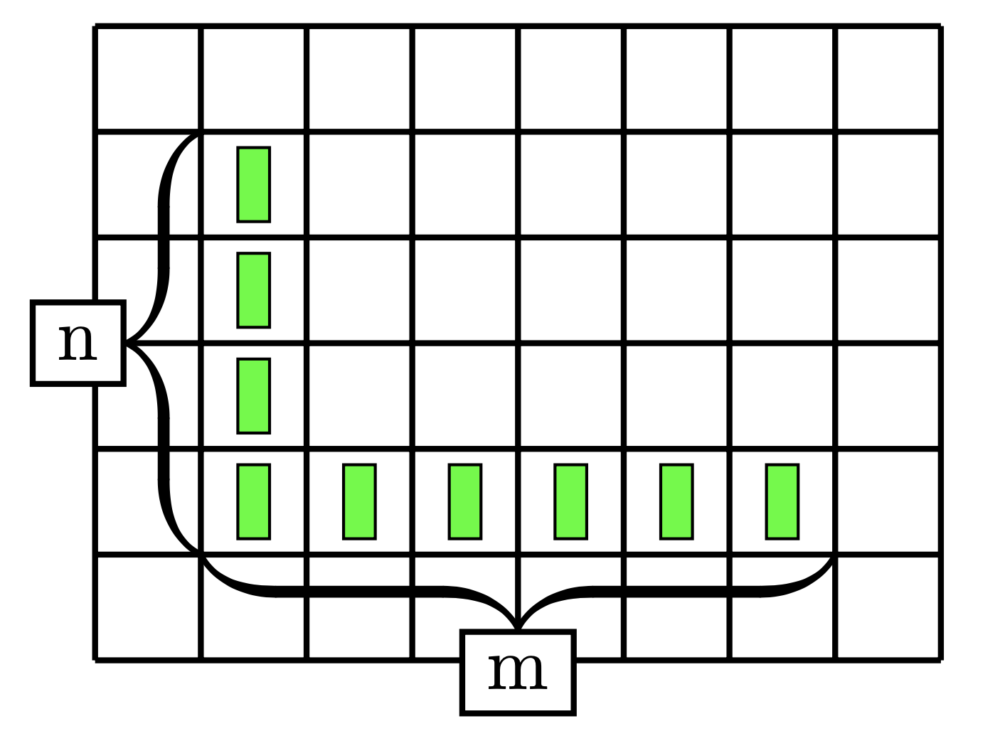

# 2D Toppling Dominoes

## Background
2D Toppling Dominoes is an adaptation of the classic [Toppling Dominoes](http://library.msri.org/books/Book63/files/131104-Fink.pdf) game. In 2D Toppling Dominoes, dominoes may be arranged in any way on a 2D grid. When a player takes a turn, they must choose a domino and knock it down either north, south, east, or west. This causes a chain reaction that knocks down a line of dominoes in that direction, stopping when an empty space is reached. Players take turns knocking down dominoes, and the first person who is unable to make a move loses.

A partisan version of this game can be played, however this project only examines the non-partisan version in which both players can choose any domino to topple.

In non-partisan Toppling Dominoes, the value of every game is a [nimber](https://en.wikipedia.org/wiki/Nimber).

#### A valid move in 2D Toppling Dominoes

## Project
This project examines the values of dominoes arranged in an L shape.

A table is created where the element in the nth row and mth column is the nim value of an n by m L arrangement of dominoes. Due to the nature of the game, this table is symmetric about the major diagonal. A base case of 1x and 2x Ls are placed in the table, then the value of larger Ls are calculated by finding the lowest value such that there is no valid move to change the game to that value (known as minimum excluded value or MEX). 

## Results
When the table is visualized as an image, the nim values create a fractal like image. The first image represents low nim values as bright and large nim values as dark.

The second image represents nim values using color to add more contrast. Lower nim values are in violet, indigo, and blue, increasing through green, orange, and yellow, with the largest values in red.

## Credit:
#### Partners
* Will Murray
* Dan Xiao
* Max Zhang
* Praj Chirathivat
* Ethan Chapman